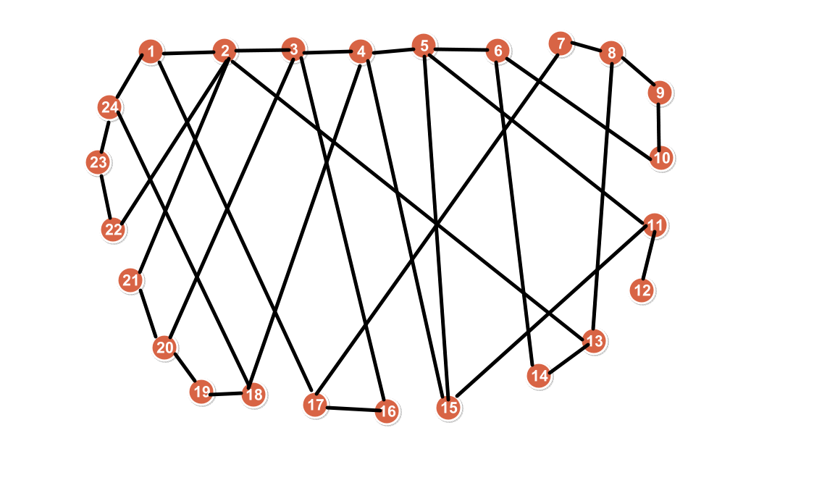

Use C++ to generate ILP formulation, ILP Formulation (for lingo) to solve the following bi-partition problem

- Given a graph with 24 nodes, please split the graph into two parts, each part has exactly 12 nodes, and the goal is to minimize the number of cut edges.

