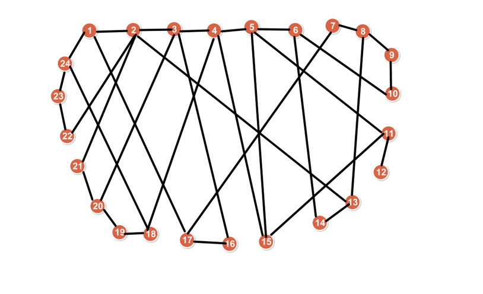
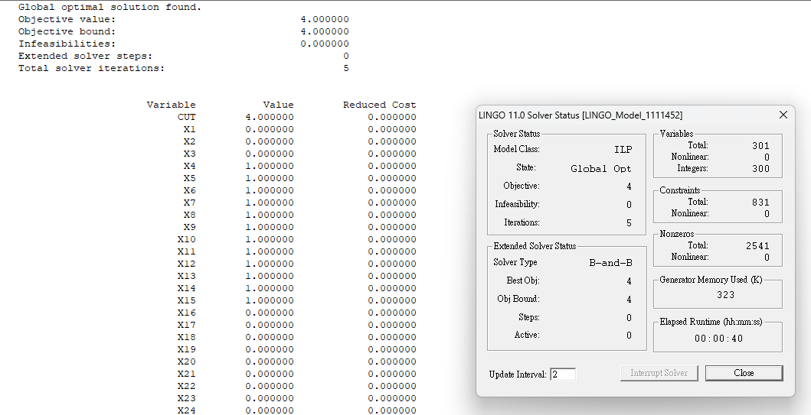

# ILP (Integer Linear Programming) - 圖形二分割問題

## 📋 問題描述

使用C++生成整數線性規劃公式，並通過LINGO求解以下圖形二分割問題：

**目標：** 將給定的24節點圖形分割為兩部分，每部分恰好包含12個節點，目標是最小化切割邊的數量。

## 🖼️ 圖形展示



*24節點的完整圖形結構*

## 📁 檔案說明

- **`Generation_Prog.cpp`** - C++程式，用於生成ILP公式
- **`LINGO_Model_1111452.lg4`** - LINGO模型檔案，包含優化問題的數學表述
- **`Explanation_1111452.docx`** - 詳細的問題解釋和解法說明
- **`graph.png`** - 原始圖形結構示意圖
- **`output.png`** - 程式執行結果截圖

## 🚀 使用方法

### C++ 程式編譯執行

```bash
# 編譯C++程式
g++ -o generation Generation_Prog.cpp

# 執行程式生成ILP公式
./generation
```

### LINGO 模型求解

1. 開啟LINGO軟體
2. 載入 `LINGO_Model_1111452.lg4` 檔案
3. 執行模型求解
4. 查看最優解結果

## 🎯 線性代數概念

此專案應用了以下線性代數概念：
- **矩陣表示法** - 用鄰接矩陣表示圖形結構
- **線性約束** - 節點分配的等式約束
- **目標函數** - 最小化切割邊數的線性目標

## 📊 結果分析



*程式執行結果和最優解視覺化*
