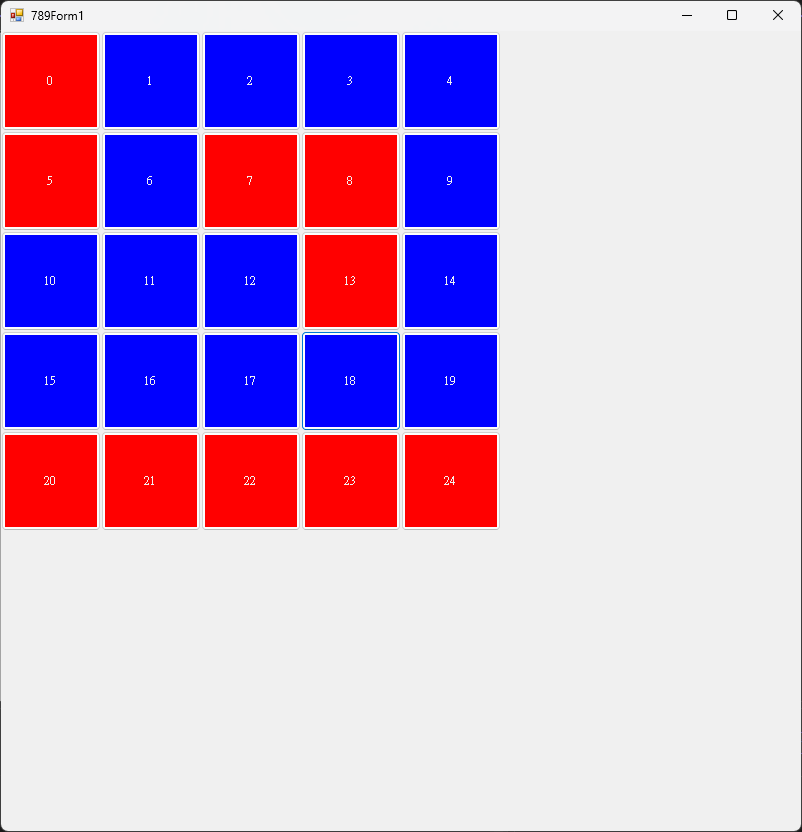

# C# 點燈遊戲 (Lights Out Game)

## 🎮 遊戲介紹

點燈遊戲（Lights Out）是一個經典的數學謎題遊戲。玩家需要將所有的燈泡都點亮（或全部熄滅），每次點擊一個燈泡時，該燈泡及其相鄰的燈泡都會改變狀態。

## 🎯 遊戲目標

- **目標：** 將所有燈泡變為相同狀態（全亮或全暗）
- **規則：** 點擊任何燈泡會改變該燈泡及其上下左右相鄰燈泡的狀態
- **挑戰：** 用最少的步數達成目標

## 🖼️ 遊戲截圖



*遊戲運行界面*

## 🔢 線性代數原理

點燈遊戲本質上是一個線性代數問題：

### 數學模型

- **狀態向量：** 用二進制向量表示每個燈泡的狀態（0=熄滅，1=點亮）
- **變換矩陣：** 每次點擊操作可以用矩陣乘法表示
- **解的存在性：** 通過矩陣的行列式和核空間分析遊戲的可解性

### 數學公式

```
初始狀態 + Σ(點擊操作矩陣) ≡ 目標狀態 (mod 2)
```

## 🛠️ 技術實現

### 核心功能

- **圖形界面：** 使用WinForms或WPF實現互動式遊戲界面
- **遊戲邏輯：** 實現燈泡狀態的切換邏輯
- **求解算法：** 使用高斯消元法求解最優解
- **步數統計：** 記錄玩家的操作步數

### 系統要求

- .NET Framework 4.5 或更高版本
- Windows 操作系統
- Visual Studio 2017 或更高版本

## 🚀 使用說明

### 編譯執行

1. 開啟 `s1111452_hw1.sln` 解決方案檔案
2. 在Visual Studio中編譯專案
3. 執行生成的程式
4. 按照遊戲規則進行操作

### 遊戲操作

- **滑鼠點擊：** 點擊任意燈泡以切換狀態
- **重新開始：** 點擊重置按鈕開始新遊戲
- **提示功能：** 查看最優解的提示

## 📊 演算法複雜度

- **時間複雜度：** O(n³) - 高斯消元法求解
- **空間複雜度：** O(n²) - 儲存變換矩陣
- **最優解：** 保證找到最少步數的解（如果存在）