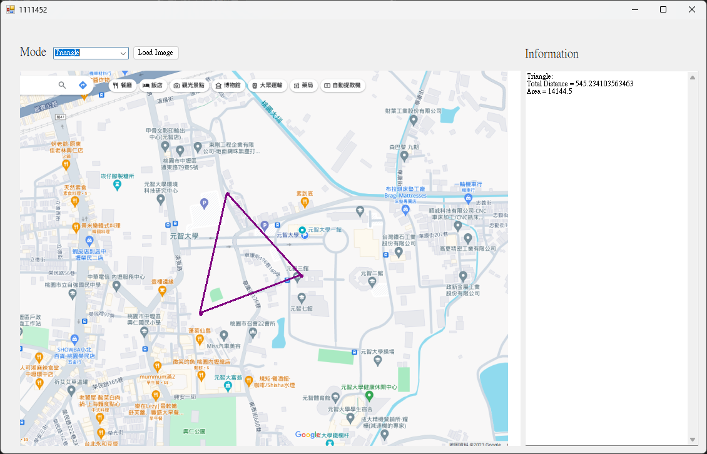
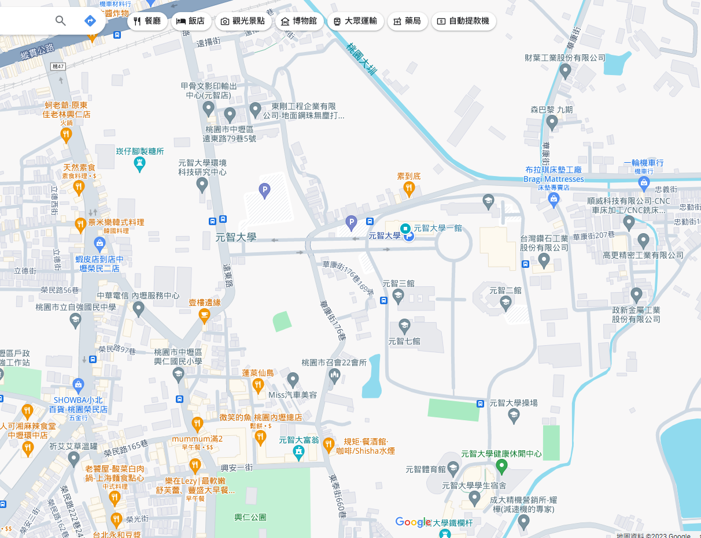

# C# 幾何測量系統

## 📐 功能概述

這是一個使用C#開發的幾何測量系統，能夠計算並報告各種幾何圖形的距離和面積。

## 📊 支援的圖形

系統支援以下幾何圖形的測量：

- **線段 (Line)** - 計算長度
- **三角形 (Triangle)** - 計算周長和面積
- **矩形 (Rectangle)** - 計算周長和面積
- **五邊形 (Pentagon)** - 計算周長和面積
- **多邊形 (Polygon)** - 計算一般多邊形的周長和面積
- **橢圓 (Ellipse)** - 計算周長和面積

## 🖼️ 程式展示



*程式運行界面展示*



*實際測量結果截圖*

## 🎯 線性代數應用

此專案中應用的線性代數概念包括：

- **向量運算** - 計算點之間的距離和方向
- **矩陣變換** - 幾何圖形的座標變換
- **行列式** - 計算三角形和多邊形面積
- **內積和外積** - 角度和面積計算

## 🚀 使用方法

### 執行環境要求

- .NET Framework 或 .NET Core
- Visual Studio 或其他C#開發環境

### 編譯與執行

1. 開啟專案目錄中的解決方案檔案
2. 使用Visual Studio編譯專案
3. 執行生成的可執行檔案
4. 按照介面提示輸入幾何圖形的參數
5. 查看計算結果

```bash
# 如果使用命令列編譯
dotnet build
dotnet run
```

## 📁 專案結構

```
exLAHomework4/
├── Program.cs          # 主程式入口
├── Shape.cs           # 幾何圖形基類
├── Triangle.cs        # 三角形類別
├── Rectangle.cs       # 矩形類別
├── Pentagon.cs        # 五邊形類別
├── Polygon.cs         # 多邊形類別
├── Ellipse.cs         # 橢圓類別
└── MathHelper.cs      # 數學輔助函數
```

## 📈 計算精度

- 使用雙精度浮點數進行計算
- 支援小數點後多位精度
- 包含錯誤處理機制
