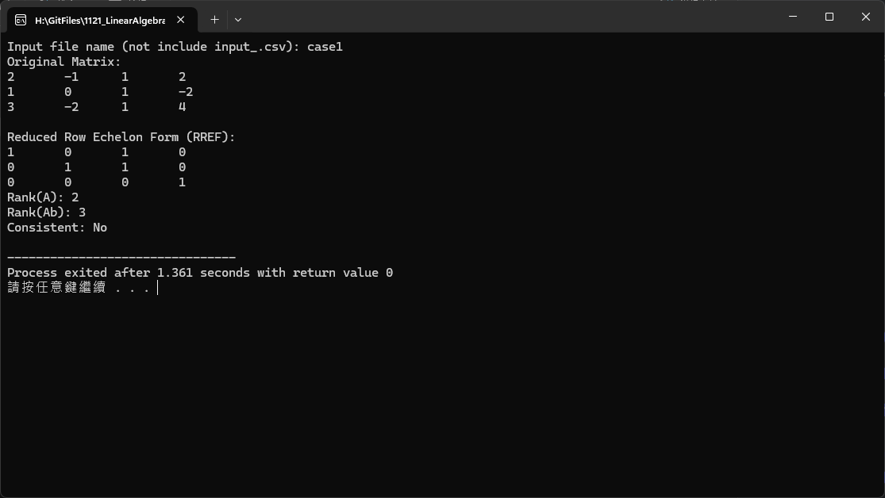

# RREF 簡化階梯形矩陣計算器

## 🧮 功能概述

使用C++實現的矩陣計算器，能夠計算矩陣的簡化階梯形（RREF）、矩陣的秩，並檢查線性方程組的一致性和解的情況。

## 🔧 主要功能

### 核心計算功能

- **RREF計算** - 將矩陣化為簡化階梯形
- **矩陣的秩** - 計算 Rank(A) 
- **增廣矩陣的秩** - 計算 Rank(A|b)
- **一致性檢查** - 檢查線性方程組是否有解
- **解的分析** - 判斷解的類型（唯一解、無窮多解、無解）

## 📊 數學理論基礎

### 線性代數核心概念

1. **階梯形矩陣（Row Echelon Form）**
   - 每一列的主元素位於前一列主元素的右方
   - 主元素下方的所有元素為零

2. **簡化階梯形矩陣（Reduced Row Echelon Form）**
   - 所有主元素為1
   - 主元素所在列的其他元素全為零

3. **矩陣的秩（Matrix Rank）**
   - 矩陣中線性無關行（或列）的最大數目
   - 等於階梯形中非零行的數目

### 線性方程組求解理論

```
對於線性方程組 Ax = b：

- Rank(A) = Rank(A|b) = n  → 唯一解
- Rank(A) = Rank(A|b) < n  → 無窮多解
- Rank(A) < Rank(A|b)     → 無解

其中 n 是未知數的個數
```

## 📁 檔案說明

- **`rref.cpp`** - 主程式碼，包含所有計算邏輯
- **`case1_input.csv`** - 測試用例的輸入矩陣數據
- **`case1_output.txt`** - 程式執行結果輸出
- **`output.png`** - 程式執行過程截圖

## 🚀 使用方法

### 編譯執行

```bash
# 編譯C++程式
g++ -o rref rref.cpp

# 執行程式
./rref
```

### 輸入格式

程式支援從CSV檔案讀取矩陣數據：

```csv
# 矩陣A的係數和常數項b
1,2,3,6
2,4,6,12
1,1,1,3
```

### 輸出範例

```
原始矩陣:
[1  2  3 |  6]
[2  4  6 | 12]
[1  1  1 |  3]

RREF矩陣:
[1  0 -1 |  0]
[0  1  2 |  3]
[0  0  0 |  0]

計算結果:
- Rank(A) = 2
- Rank(A|b) = 2
- 系統一致性: 一致
- 解的類型: 無窮多解
```

## 🖼️ 執行示範



*程式執行過程和結果展示*

## 🎯 應用場景

### 學術應用

- **線性代數教學** - 展示矩陣變換過程
- **工程計算** - 求解線性方程組
- **數值分析** - 矩陣運算驗證

### 實際問題

- **電路分析** - 求解節點電壓
- **結構力學** - 求解力的平衡方程
- **經濟模型** - 供需平衡計算

## ⚡ 算法特點

### 數值穩定性

- 使用行交換避免小主元問題
- 支援浮點數精度控制
- 處理數值誤差的容忍度設定

### 效率分析

- **時間複雜度：** O(m×n×min(m,n))
- **空間複雜度：** O(m×n)
- **適用規模：** 中小型矩陣（1000×1000以內）

## 🔍 錯誤處理

- 輸入矩陣格式驗證
- 數值溢出檢測
- 奇異矩陣特殊處理
- 檔案讀取錯誤處理
